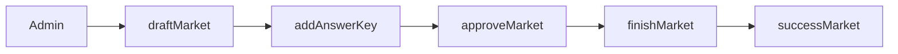
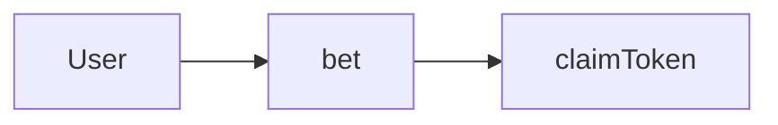

## POLYQUEST PROGRAM 

### ADMIN FLOW 

### USER FLOW

### STATES

#### 1.ConfigAccount
ConfigAccount **Struct**
#### Overview
The **ConfigAccount** struct represents a configuration account within the Anchor program. It holds various parameters that define the behavior of the betting system, such as the reward mint, the owner of the configuration, and the reward APR (Annual Percentage Rate).

Fields
- **bump** (u8): A bump seed used for deriving the account's address.
- **is_initialized** (bool): A flag indicating whether the configuration account has been initialized.
- **owner** (Pubkey): The public key of the account owner, typically the authority that can modify this configuration.
- **reward_mint** (Pubkey): The mint address of the token used for rewards.
reward_apr (u64): The Annual Percentage Rate for rewards, specified in basis points.
- **service_fee_account** (Pubkey): The public key of the account that receives service fees.
- **remain_account** (Pubkey): The account where remaining tokens will be stored.

#### 2. MarketAccount
MarketAccount **Struct**
#### Overview
The **MarketAccount** struct represents a market in the betting system. It holds essential details about the market, including its status, creator information, fees, and other relevant parameters necessary for the management of betting activities.

Fields
- **bump** (u8): A bump seed used for deriving the account's address.
exist (bool): A flag indicating whether the market exists.
- **creator** (Pubkey): The public key of the market creator.
- **bet_mint** (Pubkey): The mint address of the token used for betting.
market_key (u64): A unique identifier for the market.
- **title** (String): The title or description of the market.
- **status** (MarketStatus): The current status of the market, represented by the MarketStatus enum.
- **creator_fee** (u64): The fee amount allocated to the creator upon the market's conclusion.
- **creator_fee_percentage** (u64): The percentage fee charged to the creator.
- **service_fee_percentage** (u64): The percentage fee charged for service.
- **approve_time** (u64): The timestamp when the market was approved.
- **finish_time** (u64): The timestamp when the market was finished.
- **adjourn_time** (u64): The timestamp when the market was adjourned.
- **success_time** (u64): The timestamp when the market was marked as successful.
- **market_total_tokens** (u64): The total amount of tokens in the market.
- **market_remain_tokens** (u64): The remaining amount of tokens in the market.
- **correct_answer_key** (u64): The key representing the correct answer for the market.
- **market_reward_base_tokens** (u64): The base token amount allocated for rewards in the market.

#### 3. AnswerAccount
AnswerAccount **Struct**
#### Overview
The **AnswerAccount** struct holds the state of answers related to a specific betting market. It manages multiple answers, their associated keys, and the total tokens allocated to each answer. This struct is crucial for tracking user bets and the distribution of tokens based on correct answers.

Fields
- **bump** (u8): A bump seed used for deriving the account's address.
- **answers** (Vec<Answer>): A vector containing the answers available for the market, each represented by the Answer struct.
- **exist** (bool): A flag indicating whether the answer account exists.
- 
#### 4. BettingAccount
BettingAccount **Struct**
#### Overview
The **BettingAccount** struct tracks individual betting activity within a specific market. It stores information about the bet placed by a voter, including the market and answer associated with the bet, the amount of tokens bet, and the time of creation.

Fields
- **bump** (u8): A bump seed used for deriving the account's address.
- **market_key** (u64): A unique identifier for the betting market.
- **answer_key** (u64): A unique identifier for the answer selected by the voter.
- **voter** (Pubkey): The public key of the voter who placed the bet.
- **tokens** (u64): The number of tokens wagered by the voter.
- **create_time** (u64): The time when the bet was created, represented as a Unix timestamp.
- **exist** (bool): A flag indicating whether the betting account exists.

### INSTRUCTIONS
#### I. Admin function 

1. **draft_market**
##### Overview 
The draft_market function is responsible for initializing a new MarketAccount on the Solana blockchain. This function sets up the market with essential parameters like the creator’s public key, title, fees, and time of approval. It also emits a MarketDrafted event once the market is successfully created.

##### Parameters
- **ctx**: Context<DraftMarket> – The context holding all relevant accounts and system information required for the transaction.
- **market_key**: u64 – A unique key that identifies the market.
- **creator**: Pubkey – The public key of the user who is creating the market.
- **title**: String – The title or name of the market.
- **create_fee**: u64 – The fee charged for creating the market.
- **creator_fee_percentage**: u64 – The percentage of fees allocated to the creator of the market.
- **service_fee_percentage**: u64 – The percentage of fees allocated to the platform for service charges.

##### Accounts

- **owner**: Signer<'info> – The account of the user who owns the market and pays for the transaction. The owner must be the same as the one defined in the config_account.
- **bet_mint**: Account<'info, Mint> – The account holding the token mint for placing bets on the market.
- **config_account**: Account<'info, ConfigAccount> – The global configuration account containing relevant settings and the owner’s public key.
- **market_account**: Account<'info, MarketAccount> – The newly created market account that stores market-specific data.
- **system_program**: Program<'info, System> – The system program required for initializing the market.

2. **approve_market**

##### Overview
The approve_market function is responsible for changing the status of a MarketAccount to "Approved." This function can only be executed by an authorized account, and upon successful approval, it emits a MarketApproved event.

##### Parameters
ctx: Context<ApproveMarket> – The context containing all relevant accounts and system information required for the transaction.

##### Accounts
- **owner**: Signer<'info> – The account of the market owner. This account must be the same as the one registered in the config_account. If not, the transaction will fail with an Unauthorized error.
- **config_account**: Account<'info, ConfigAccount> – The global configuration account containing relevant settings, including the owner’s public key.
- **market_account**: Account<'info, MarketAccount> – The market account that is to be approved.
- **system_program**: Program<'info, System> – The system program, required for handling system-level instructions.

3. **add_answer_key**

##### Overview
The **add_answer_keys** function allows an authorized user to add new answers to a specific **MarketAccount** within the constraints of the program. Each AnswerAccount can store up to a predefined maximum number of answers. This function ensures that the answers are unique and emits an **AnswerAdded** event once the new answers are successfully added.

##### Parameters
- ctx: Context<AddAnswer> – The context containing all the relevant accounts and - system information required for the transaction.
answer_keys: Vec<u64> – A vector of answer keys to be added to the AnswerAccount.

##### Accounts
- **owner**: Signer<'info> – The account of the market owner. This must match the owner recorded in the config_account. Unauthorized users will be rejected.
- **config_account**: Account<'info, ConfigAccount> – The configuration account that holds the program's global settings and authorized owner information.
- **market_account**: Account<'info, MarketAccount> – The account representing the market to which answers are being added.
- **answer_account**: Account<'info, AnswerAccount> – The account that stores the answers for a specific market. This account is created (if needed) using the ANSWER_SEED and the market_key as seeds for the address.
- **system_program**: Program<'info, System> – The system program required for creating or interacting with accounts.

4. **finish_market**

##### Overview
The **finish_market** function marks a market as "Finished" and records the end time and remaining tokens. This action is allowed only for approved markets and must be performed by the authorized owner. Once completed, it emits a **MarketFinished** event, signaling the market's closure and providing relevant details such as the end time and the number of tokens remaining in the market.

##### Parameters
- **ctx**: Context<FinishMarket> – The context containing all relevant accounts for the transaction.

##### Accounts
- **owner**: Signer<'info> – The account of the market owner. This account must match the owner in the config_account. If not, the transaction will return an Unauthorized error.
- **config_account**: Account<'info, ConfigAccount> – The configuration account holding the global settings, including the owner’s public key.
- **market_account**: Account<'info, MarketAccount> – The account representing the market that is being finished. This market must have a status of Approved to be finished, or the transaction will return a MarketNotApproved error.
- **system_program**: Program<'info, System> – The system program required for system-level instructions.

5. **success_market**

##### Overview
The **success_market** function is designed to mark a market as successful when the correct answer key is provided. It calculates fees for the market creator and the service, and distributes the remaining tokens accordingly. This function also emits a **MarketSuccess** event.

##### Parameters
- **ctx**: Context<SuccessMarket> – The context containing all relevant accounts needed to mark the market as successful.
- **correct_answer_key**: u64 – The key representing the correct answer for the market.

##### Accounts
- **owner**: Signer<'info> – The owner of the market. The function ensures that this account matches the owner in the config_account. If not, it returns an Unauthorized error.
- **config_account**: Account<'info, ConfigAccount> – The configuration account holding global settings, including the owner and service fee account.
- **bet_mint**: Box<InterfaceAccount<'info, Mint>> – The mint for the tokens being used for bets.
- **creator_token_account**: Box<InterfaceAccount<'info, TokenAccount>> – The token account owned by the market creator, used to receive creator fees.
- **service_token_account**: Box<InterfaceAccount<'info, TokenAccount>> – The token account owned by the service fee account, used to receive service fees.
- **market_account**: Account<'info, MarketAccount> – The market account being processed, which must be in the Finished status.
- **vault_token_account**: Box<InterfaceAccount<'info, TokenAccount>> – The vault holding tokens to be distributed to the creator and service fee accounts.
- **answer_account**: Account<'info, AnswerAccount> – The account holding possible answers for the market.
- **token_program**: Program<'info, Token> – The SPL token program to handle transfers.
- **token_2022_program**: Program<'info, Token2022> – The token 2022 program, if using features introduced in the 2022 version of SPL tokens.
- **associated_token_program**: Program<'info, AssociatedToken> – Program used for creating associated token accounts.
- **system_program**: Program<'info, System> – The system program for Solana.

   
#### II. User function 

1. **bet**

##### Overview
The **bet** function allows a user to place a bet on a market by selecting an answer and transferring tokens to a pool. The function handles token transfers, updates the relevant accounts, and emits a **BetPlaced** event.

##### Parameters
- **ctx**: Context<Bet> – The context containing all relevant accounts needed for placing a bet.
- **answer_key**: u64 – The key representing the chosen answer for the bet.
- **amount**: u64 – The amount of tokens to bet.

##### Accounts
- **voter**: Signer<'info> – The account of the user placing the bet.
- **config_account**: Account<'info, ConfigAccount> – The global configuration account.
- **bet_mint**: Box<InterfaceAccount<'info, Mint>> – The token mint used for betting.
- **user_token_account**: InterfaceAccount<'info, TokenAccount> – The user's token account from which the bet amount will be transferred.
- **vault_token_account**: Box<InterfaceAccount<'info, TokenAccount>> – The token vault for the market, where the user's tokens will be transferred.
- **market_account**: Box<Account<'info, MarketAccount>> – The market on which the user is placing the bet. The market must have an approved status.
- **answer_account**: Box<Account<'info, AnswerAccount>> – The account containing the possible answers for the market.
- **bet_account**: Box<Account<'info, BettingAccount> – The account where the details of the user's bet will be stored.
- **token_program**: Program<'info, Token> – The SPL token program to handle token transfers.
- **token_2022_program**: Program<'info, Token2022> – The 2022 token program (for using updated SPL token features).
- **ssociated_token_program**: Program<'info, AssociatedToken> – The program for creating associated token accounts.
- **system_program**: Program<'info, System> – The Solana system program.

2. **claim_token**

##### Overview
The **claim_token** function allows users to claim their betting rewards and dividends after the market has reached a conclusion. Users can claim tokens based on whether their answer was correct, or if the market has been adjourned. The function also handles reward token distribution and emits relevant events to track token claims.

##### Parameters
- **ctx**: Context<ClaimToken> – The context containing all relevant accounts needed for claiming tokens.

##### Accounts
- **voter**: Signer<'info> – The user claiming the tokens.
- **config_account**: Account<'info, ConfigAccount> – The global configuration account.
- **bet_mint**: Box<InterfaceAccount<'info, Mint>> – The token mint used for betting.
- **reward_mint**: Box<InterfaceAccount<'info, Mint>> – The token mint used for reward distribution.
- **user_bet_token_account**: Box<InterfaceAccount<'info, TokenAccount> – The user's account where bet tokens will be claimed.
- **vault_bet_token_account**: Box<InterfaceAccount<'info, TokenAccount> – The token vault holding the market's bet tokens.
- **user_reward_token_account**: Box<InterfaceAccount<'info, TokenAccount> – The user's account where reward tokens will be claimed.
- **vault_reward_token_account**: Box<InterfaceAccount<'info, TokenAccount> – The token vault holding the market's reward tokens.
- **market_account**: Box<Account<'info, MarketAccount> – The market where the user placed their bet.
- **bet_account**: Box<Account<'info, BettingAccount> – The account containing the user's bet details.
- **answer_account**: Box<Account<'info, AnswerAccount> – The account containing possible answers for the market.
- **token_program**: Program<'info, Token> – The SPL token program for token transfers.
- **token_2022_program**: Program<'info, Token2022> – The 2022 token program (for using updated SPL token features).
- **associated_token_program**: Program<'info, AssociatedToken> – The program for creating associated token accounts.
- **system_program**: Program<'info, System> – The Solana system program.